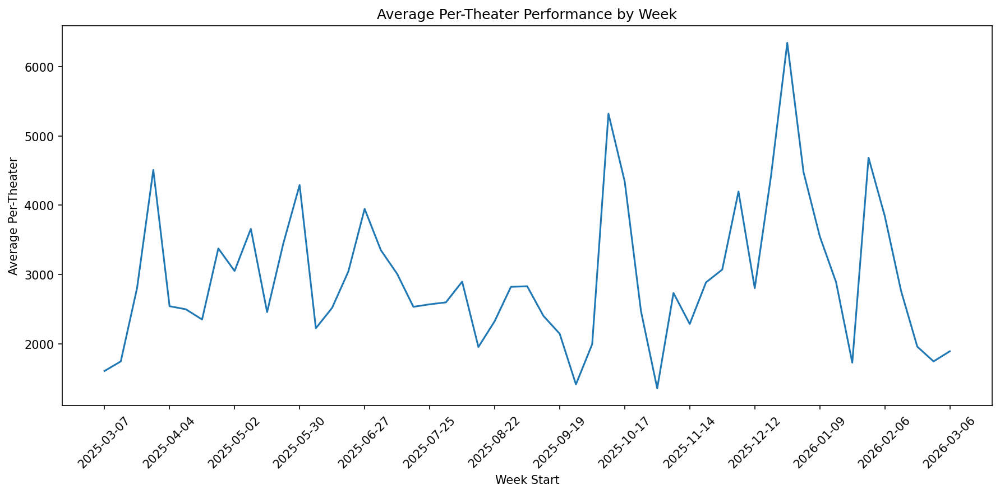
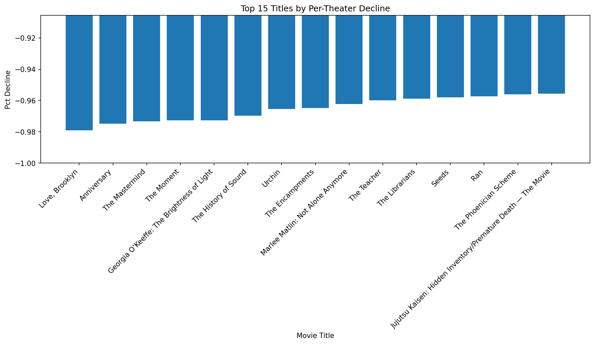
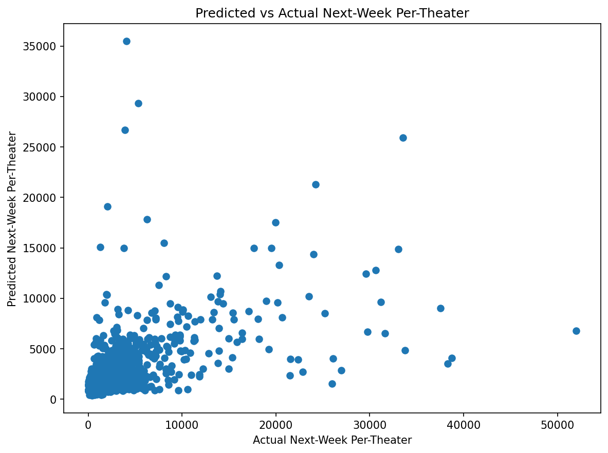

# Optimizing Film Holdovers  
### A SQL + Python analysis of per-theater performance decline to support theatrical scheduling decisions

## Overview

This project analyzes weekly domestic box office data from **The Numbers** across a one-year period to identify a scheduling bottleneck in theatrical programming: films may continue occupying screen capacity even after normalized performance weakens.

I built a lightweight analytics workflow using **Python, SQLite, SQL, and matplotlib** to:
- collect weekly theatrical performance data
- clean and standardize the dataset
- measure week-over-week per-theater decay
- classify titles into recommendation buckets
- estimate next-week per-theater performance with a simple regression model

The project is designed to mirror the kind of thinking needed for a **Film Strategy & Analytics** role, where programming decisions should be informed by trend signals, release age, and theater productivity.

---

## Business Objective

The goal of this project was to test whether theatrical scheduling decisions could be improved by using **per-theater performance decay** to identify which films should be:
- reduced
- held
- supported
- expanded

Instead of relying only on headline gross figures, this project emphasizes **normalized performance per theater** and week-over-week momentum.

---

## Project Goals

## Key Metrics

- **53 weekly charts collected**
- **3,625 movie-week rows**
- **583 unique titles**
- **3,041 recommendation rows exported**
- **Model MAE:** 1106.88
- **Model R²:** 0.3423

- Build a clean, reproducible theatrical analytics workflow
- Use SQL to analyze film-level performance over time
- Create a rule-based recommendation framework for scheduling decisions
- Apply a simple predictive model to estimate next-week per-theater performance
- Present results clearly through charts and GitHub documentation

---

## What Was Done

- Collected **53 weekly domestic box office charts**
- Built a dataset with **3,625 movie-week records**
- Captured **583 unique film titles**
- Cleaned and standardized source data in Python
- Loaded the cleaned dataset into **SQLite**
- Used SQL to:
  - explore the dataset
  - calculate week-over-week per-theater change
  - assign recommendation categories
- Built a simple **linear regression model** to estimate next-week per-theater performance
- Created visualizations to summarize trends, decline risk, and model behavior

---

## Tools Used

- **Python**
- **pandas**
- **SQLite**
- **SQL**
- **matplotlib**
- **scikit-learn**
- **VS Code**
- **Git / GitHub**

---

## Dataset

Source: **The Numbers** weekly domestic box office chart pages

Date range analyzed:
- **2025-03-07 through 2026-03-06**

Core fields collected:
- rank
- previous rank
- movie title
- weekly gross
- weekly change
- theaters
- theater average
- total gross
- days in release
- week start
- source URL

---

## Key Exploratory Findings

- The final dataset contains **3,625 rows** across **583 unique titles**
- Weekly summary analysis returned **53 weekly observations**, matching the requested date range
- New releases significantly outperformed non-new releases on average:
  - **new releases** averaged about **$9,364 per theater**
  - **non-new releases** averaged about **$1,993 per theater**
- This supported the idea that **release age** is an important driver of theatrical scheduling decisions

---

## Recommendation Logic

A rule-based recommendation framework was created using:
- week-over-week per-theater change
- days in release
- theater count
- current per-theater level

Recommendation outputs:
- `REDUCE`
- `HOLD`
- `HOLD_OR_SUPPORT`
- `EXPAND_OR_SUPPORT`

Example interpretation:
- wide titles with steep negative decay were flagged for `REDUCE`
- positive-momentum titles were often flagged for `EXPAND_OR_SUPPORT`

The recommendation export produced **3,041 scored movie-week rows** with the following distribution:
- `HOLD`: 1,857
- `EXPAND_OR_SUPPORT`: 896
- `REDUCE`: 167
- `HOLD_OR_SUPPORT`: 121

The full recommendation output is saved in:
- `data/processed/recommendation_outputs.csv`

A smaller review-friendly sample is saved in:
- `data/processed/recommendation_examples.csv`

### Sample Recommendation Examples

| Movie Title | Week Start | Recommendation |
|---|---|---|
| Mickey 17 | 2025-03-14 | REDUCE |
| Rule Breakers | 2025-03-14 | REDUCE |
| 2025 Oscar Shorts | 2025-03-14 | EXPAND_OR_SUPPORT |
| Love & Pop | 2025-03-14 | EXPAND_OR_SUPPORT |
| Dog Man | 2025-03-14 | HOLD_OR_SUPPORT |

---

## Predictive Modeling

A simple **linear regression** model was built to estimate **next-week per-theater performance** using:
- current per-theater
- theater count
- days in release
- new-release flag
- wide-release flag

Model results:
- **Rows used for modeling:** 3,040
- **MAE:** 1106.88
- **R²:** 0.3423

This was treated as a directional forecasting tool rather than a final production model.

---

## Data Visualizations

### 1. Average Per-Theater Performance by Week
This chart shows how average theater productivity changed across the 53-week period.



### 2. Top 15 Titles by Per-Theater Decline
This chart highlights films with the sharpest week-over-week per-theater drops.



### 3. Predicted vs Actual Next-Week Per-Theater
This chart compares the model’s predicted next-week per-theater values to actual observed values.



---

## Observations from the Visualizations

- The weekly per-theater chart showed meaningful variation across the year, confirming that theatrical productivity shifts over time and should not be treated as static
- The decline chart highlighted a subset of films with severe week-over-week deterioration, supporting the case for faster schedule reduction decisions
- The predicted-vs-actual chart showed that the model captured some directional signal, though there is clear room for improvement through feature refinement and stronger model validation

---

## Lean Six Sigma / Process Improvement Framing

### Problem
Scheduling adjustments may lag real demand decay.

### Waste
Screen capacity may remain tied to weakening holdovers longer than necessary.

### Root Cause
Programming decisions may underuse normalized performance trend signals such as **per-theater decline**.

### Improvement
Implement a weekly film review framework driven by:
- per-theater momentum
- days in release
- release width
- recommendation logic

### Control
Review recommendations weekly and standardize programming follow-up actions.

---

## Project Structure

```text
alamo-film-strategy-project/
├── data/
│   ├── raw/
│   └── processed/
├── outputs/
├── scripts/
├── sql/
├── README.md
└── requirements.txt